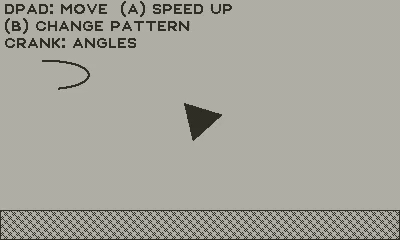
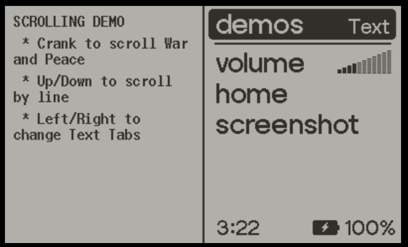

# Sampler

This is a seat-of-the-pants exploration of different aspects of
Playdate C API Programming as I wander around the sea of
possibilities.

## How to use it

There are a number of different samples (some of which have stuff, and
some are just aspirational).  Use the menu button to move between demos.

Some of the demos (especially the text ones) have help text on
the menuImage:

The demos:

* Drawing API
* A couple of bitmap-oriented ones
* Text (this has help text in the menuImage, and yes it has all of War and Peace)
* Audio
* Sprite (aspirational)
* Bitmap tables (aspirational)

