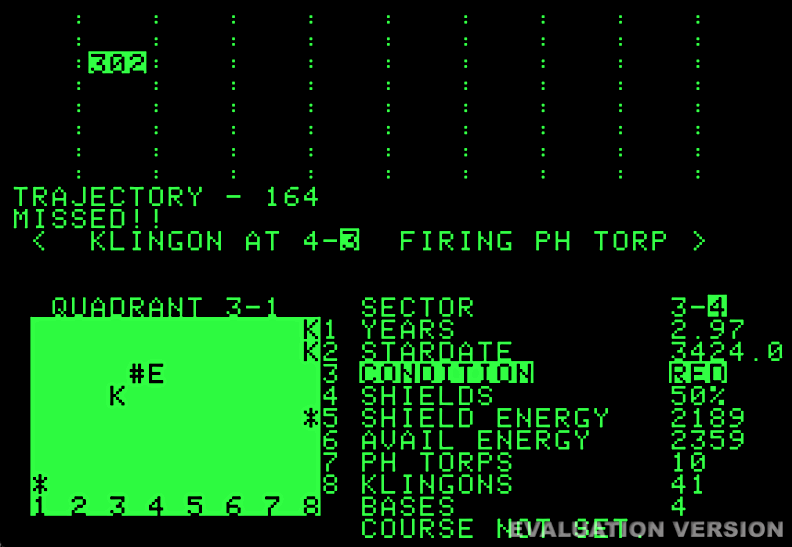
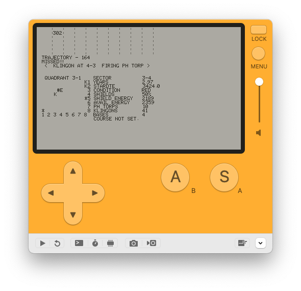
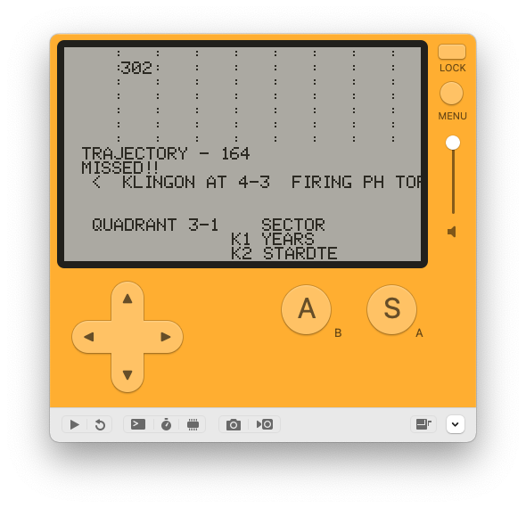
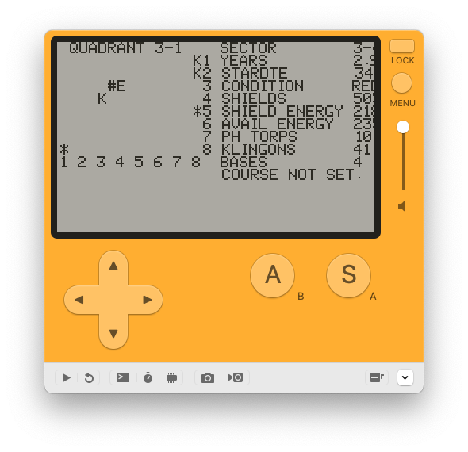
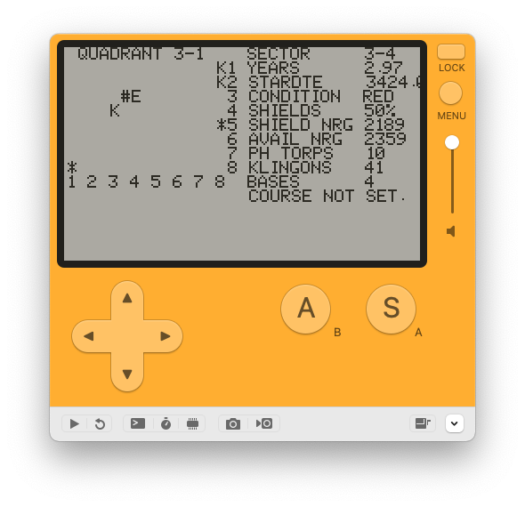

# Trek

Port of the classic Apple Trek game.

## Bringing it to Playdate

Of course, the screens between the Apple ][ and the Playdate are
quite different.  One is 40x24 characters, the other is 400x240,
which seems like it works out great, but the Apple ][ typeface 
is five points wide and 8 tall, giving 66 x 26, so doubling the
Apple font isn't going to work.

default size, things are tiny

double-size, things fall off the screen pretty early

For my bad eyes, the second one is actually readable without having to stick
my nose against the screen.

So, maybe could have a couple of panes - galaxy in one, maybe the sector
chart and current settings in another, running at 2x (or doubling the font
size)

This could be do-able

So close! Using NRG as an abbrv, it pretty much all fits except the decimal
for the stardate.  That we could drop.

