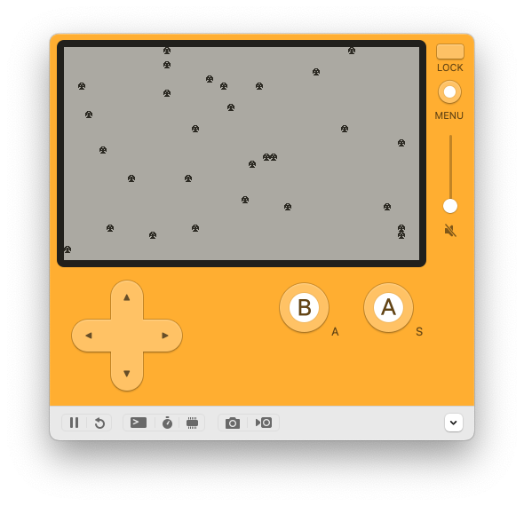

# Zampler

Sampler stuff, but in Zig.

* A Daleks-like game
* more SDK exploration cards

* `killall -q "Playdate Simulator" && open zig-out/zampler.pdx`

```zig
zig build && killall -q "Playdate Simulator" && open zig-out/zampler.pdx
```


Please visit the real repo for the zig template: https://github.com/DanB91/Zig-Playdate-Template

# Development

-----

it draws!



-----


# Graveyard

* when we move to multiple cards, this is from the zig template, with
  the addition of bouncing around the image 

```zig
    pd.graphics.clear(@intFromEnum(pdapi.LCDSolidColor.ColorWhite));

    if (current == 0) {
        _ = pd.graphics.drawText("BorkB", 5, .UTF8Encoding, 0, 0);
        pd.graphics.drawBitmap(g_playdate_image, 
                               pdapi.LCD_COLUMNS / 2 - 16, 
                               pdapi.LCD_ROWS / 2 - 16,
                               .BitmapUnflipped);
    } else {
        _ = pd.graphics.drawText("Greeble", 7, .UTF8Encoding, 0, 0);
        mongoLog(pd, "{b} {b} {b}\n", .{ current, pushed, released });

        const rp = geo.randomPoint();

        pd.graphics.drawBitmap(g_playdate_image, 
                               rp.x + pdapi.LCD_COLUMNS / 2 - 16, 
                               rp.y + pdapi.LCD_ROWS / 2 - 16,
                               .BitmapUnflipped);
    }
```